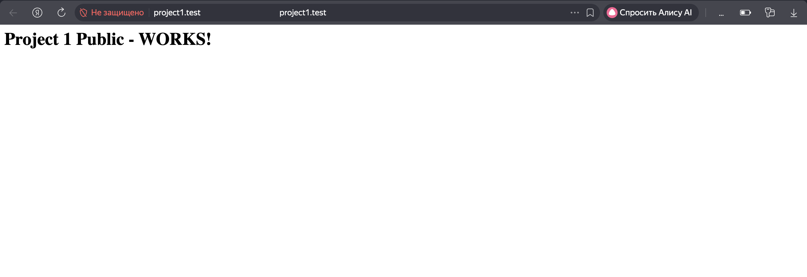
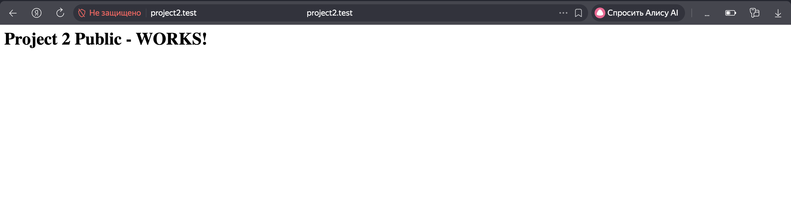
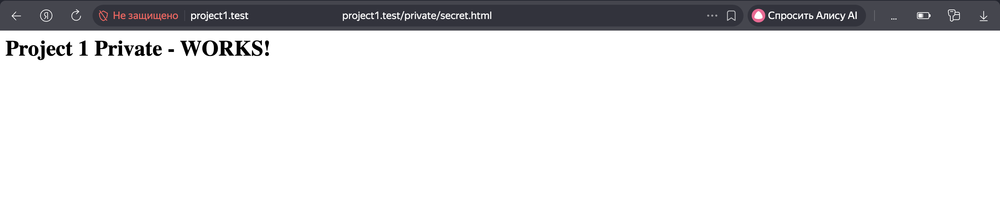
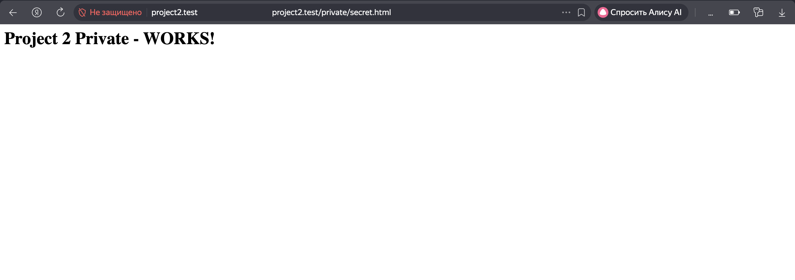
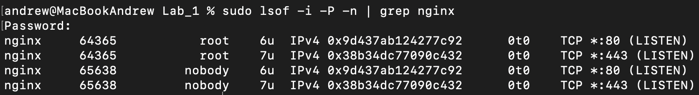

# Лабораторная работа №1

## Что было сделано
Настроен веб-сервер Nginx для обслуживания двух различных веб-проектов на одном сервере.

## Как мы это делали
1. Установили Nginx. На mac это делается через homebrew с помощью `brew install nginx`
2. Чтобы не было проблем с правами доступа, пет-проекты были сделаны в `/tmp/nginx_test/` (DeepSeek сказал так будет лучше):
```
sudo mkdir -p /tmp/nginx_test/project1/{public,private}
sudo mkdir -p /tmp/nginx_test/project2/{public,private}
```
3. Подписали собственные SSL сертификаты:
```
sudo openssl req -x509 -nodes -days 365 -newkey rsa:2048 \
  -keyout /opt/homebrew/Cellar/nginx/1.29.4/.bottle/etc/nginx/ssl/project1.key \
  -out /opt/homebrew/Cellar/nginx/1.29.4/.bottle/etc/nginx/ssl/project1.crt \
  -subj "/CN=project1.test"
```
4. После долгого изучения работы nginx был написан основной конфиг:
```
worker_processes  1;

events {
    worker_connections  1024;
}

http {
    include       mime.types;
    default_type  application/octet-stream;

    sendfile        on;
    keepalive_timeout  65;

    # Project1.test - HTTP редирект
    server {
        listen 80;
        server_name project1.test;
        return 301 https://$server_name$request_uri;
    }

    # Project1.test - HTTPS
    server {
        listen 443 ssl;
        server_name project1.test;

        ssl_certificate /opt/homebrew/Cellar/nginx/1.29.4/.bottle/etc/nginx/ssl/project1.crt;
        ssl_certificate_key /opt/homebrew/Cellar/nginx/1.29.4/.bottle/etc/nginx/ssl/project1.key;

        root /Users/andrew/Sites/project1/public;
        index index.html index.htm;

        location /private/ {
            alias /Users/andrew/Sites/project1/private/;
        }
    }

    # Project2.test - HTTP редирект
    server {
        listen 80;
        server_name project2.test;
        return 301 https://$server_name$request_uri;
    }

    # Project2.test - HTTPS
    server {
        listen 443 ssl;
        server_name project2.test;

        ssl_certificate /opt/homebrew/Cellar/nginx/1.29.4/.bottle/etc/nginx/ssl/project2.crt;
        ssl_certificate_key /opt/homebrew/Cellar/nginx/1.29.4/.bottle/etc/nginx/ssl/project2.key;

        root /Users/andrew/Sites/project2/public;
        index index.html index.htm;

        location /private/ {
            alias /Users/andrew/Sites/project2/private/;
        }
    }
}
```
Впрочем, не будем скрывать, что это немного измененный базовый конфиг с изменными прослушиваемыми портами, рабочими директориями и ссылками на сертификаты.

## Тестирование
Вот что мы протестировали:
* Проверка редиректа HTTP c помощью `curl -I http://project1.test`

* Проверка HTTPS (просто вбиваем адрес в браузере)


* Проверка alias (аналогично предыдущему)


* Проверка портов с помощью `sudo lsof -i -P -n | grep nginx`

Прослушиваются только 80 и 443 порты, ничего лишнего.

## Выводы
Мы проделали долгий путь, а именно: 
* Успешная настройка сложной конфигурации Nginx с несколькими виртуальными хостами
* Понимание работы HTTPS и редиректов
* Понимание работы SSL-сертификатов.

Нам очень понравилась эта лабороторная работа. Лично у меня появились мысли стать DevOps-ером.