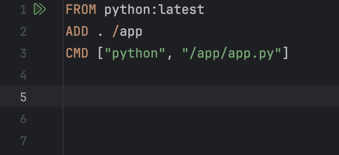
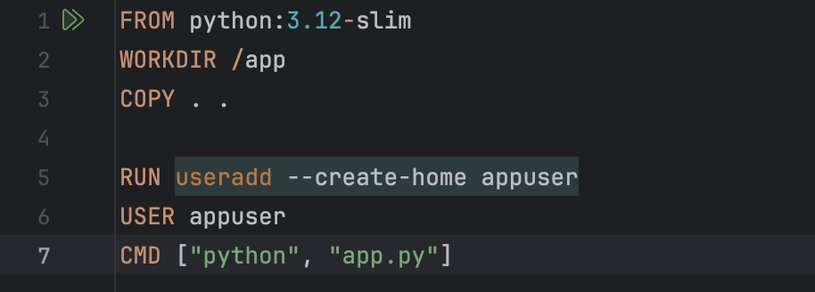

# Отчет по лабораторной работе №2 (обычная)

## Цель работы
### Научиться работать с docker-файлами и контейнерами, а также изучить плохие и хорошие практики по работе с docker-файлами и контейнерами.

## Ход работы
### 1. Описание программы

##### Данная программа, реализованная на Python, сначала считает число, переводит его в двоичную систему счисления, а затем 100 раз его выводит, при этом каждый вывод задерживается на одну секунду. 
### 2. Плохой Dockerfile

### 3. Хороший Dockerfile

#### Сборка

### 4. Сравнение результатов

##### Показаны затраты памяти при запуске плохого и хорошего docker-файла. Разница конечно существенная)

### 5. Описание плохих практик в Dockerfile

#### 5.1. Использование тега latest
##### latest – это указатель на самый свежий образ. В первое время может работать после сборки, но с момента выхода новой версии все ломается. Чтобы такого не было лучше указывать конкретную версию, что и исправлено в хорошем docker-файле.

#### 5.2. ADD вместо COPY
##### ADD позволяет копировать файлы, автоматически распаковывает архивы и скачивает файлы по URL. Проблема в том, что так может скачаться вредоносный файл. COPY только копирует файлы из папки в образ, поэтому безопаснее использовать его, как и сделано в "хорошем" docker-файле. 

#### 5.3. Запуск от root
##### Если в docker-файле нет USER, как в "плохом" docker-файле, то контейнер работает от root. Почему это плохая практика? Во-первых, если злоумышленник взламывает приложение, то у него сразу появляются права супер-пользователя. Во-вторых,баг в коде может сломать системные файлы контейнера. Если прописан USER, как в "хорошем" docker-файле то данные риски сразу снижаются. 

### 6. Плохие практики работы с контейнерами

#### 6.1. Запуск без --rm
##### Как показано на данном скриншоте, каждая команда запускает новый контейнер, это занимает больше места на диске и оно быстрее заканчивается и накапливается много мертвых контейнеров, которые не нужны. Чтобы такого не было нужно запускать с "--rm", чтобы контейнер в конце удалялся.

##### Вот к чему это приводит:

#### 6.2. Запуск с --privileged
##### Отключает всю изоляцию контейнера, Контейнер так получает полный доступ ко всем устройствам хост-системы. Так с помощью вредоносного кода злоумышленник может получить контроль над всей системой.
#### Без:

#### С:

## Вывод
### В данной лабораторной работе мы познакомились и научились писать простые docker-файлы, познакомились с плохими и хорошими практиками. Также мы изучили как нужно правильно работать с контейнерами, ведь безопасность важна везде.
